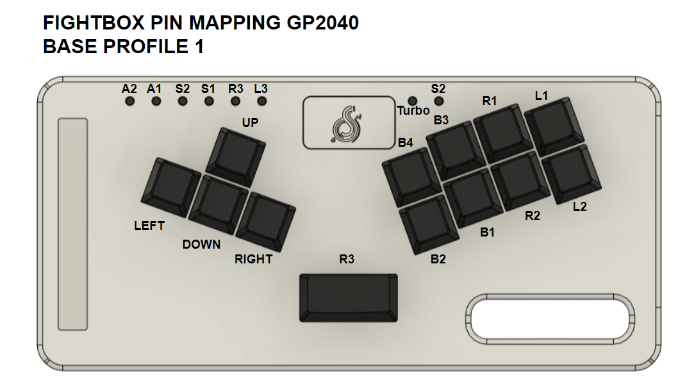

# FightBox-GP2040-Controller
This Project is for create Controller Based On GP2040 Firmware using cheap material like 3D Case and HandWiring motode. With Cheap Microcontroller like [RP2040](https://www.tokopedia.com/find/rp2040) and Mechanical switch that you can choose the you like. And this controller using standart Keycaps that you easly can buy.

  

This is first version, you can Download STL File for case and printed it self or Edited STEP 3D model if you want. The are 2 type of button : normal button using mechanical Switch and keycap and tactile switch 6x6 with height 11mm without cap.

## Specification
- Microcontroller RP2040 Raspberry pi pico 2MB Type C
- Firmware GP2040
- 13 Mechanical Switch
- 1 Stabilazer 2u
- 12 Keycap 1u Transparant
- 1 Keycap 2u Transparant
- 13 + 4 led rgb ws2812b
- 8 Tactile switch 6x6x11mm
- 9 Rubber feet D 10mm H 3mm
- 10 M3 10mm Flat Head or JF
- 3D print Case 

version | Current Version (First Version) | 
------- | ------------------------- | 
case dimensions | 234x111x23mm |
compatibility | PC, PS3, PS4 Switch |
firmware | [GP2040-CE](https://gp2040-ce.info/) | 
Microcontroller | Raspberry pico RP2040 2MB|

## Pin Mapping

  
  

## XBOX Mapping

  

## Player LED

  

## Privew Hardware

  
  
  

## Privew Video
